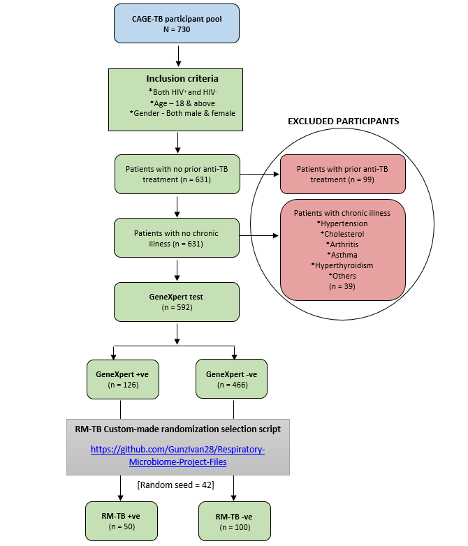

# Respiratory Microbiome Project
This repository contains all the source code used to conduct the "Respiratory Microbiome Project (RM-TB)".
## RM-TB Sample selection criteria

The diagram outlines the participant selection criteria for a study on tuberculosis (TB) and microbiota:  

1. **Initial Pool:** The study starts with 730 participants from the CAGE-TB pool.  
2. **Inclusion Criteria:** Participants must be HIV+ or HIV−, aged 18 or above, and of any gender.  
3. **Exclusion Criteria:**  
   - 99 participants with prior anti-TB treatment were excluded.  
   - 39 participants with chronic illnesses (e.g., hypertension, asthma, arthritis, cholesterol, e.t.c) were excluded.  
4. **Final Selection:**  
   - 631 eligible participants remained.  
   - 592 underwent a **GeneXpert** TB diagnostic test.  
   - Based on results: 126 were **TB-positive (GeneXpert+),** and 466 were **TB-negative (GeneXpert−).**  
5. **Randomized Selection:** Using a custom script (seed = 42), a subset was chosen:  
   - 50 **GeneXpert+ (RM-TB+).**  
   - 100 **GeneXpert− (RM-TB−).**  

This process ensured a well-defined and controlled sample selection that can be replicated for microbiota analysis.